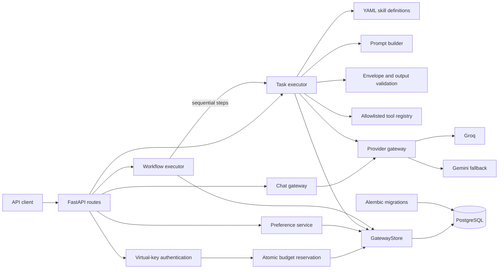
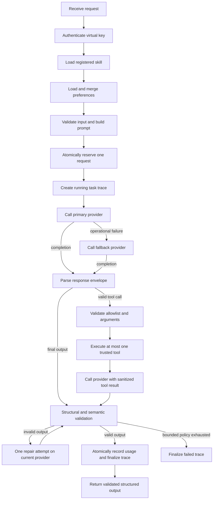
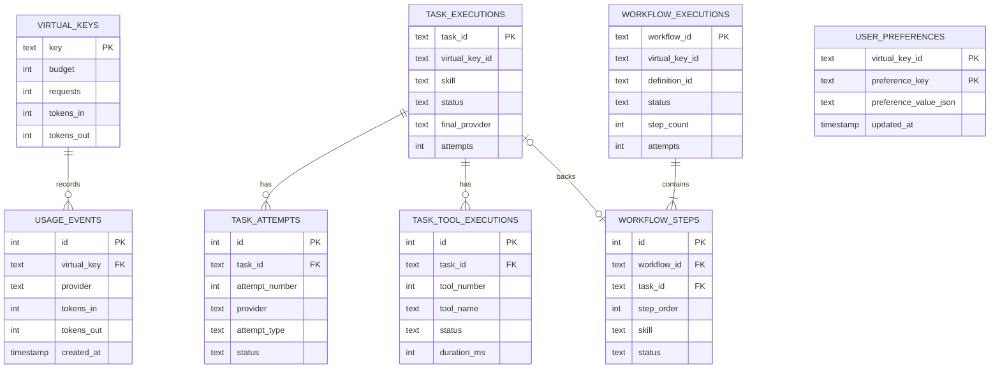

# Orchestrix

A production-inspired AI execution platform for deterministic workflows, structured output validation, provider abstraction, bounded tool execution, authenticated usage controls, and persistent execution tracing.

Orchestrix supports direct chat completions, schema-validated skills and fixed sequential workflows while keeping provider credentials, fallback policy, accounting, and orchestration under application control.

## Live Demo

- **API Base URL:** https://orchestrix-yc6s.onrender.com
- **Interactive API Docs:** https://orchestrix-yc6s.onrender.com/docs
- **OpenAPI Specification:** https://orchestrix-yc6s.onrender.com/openapi.json
- **Health Check:** https://orchestrix-yc6s.onrender.com/healthz

> The application is hosted on Render’s free tier and may take around a minute to wake after inactivity.

## Key capabilities

- Bearer authentication with predefined virtual API keys and request budgets
- Atomic PostgreSQL budget reservation under concurrent requests
- Groq as the primary provider with Gemini fallback
- Gateway-owned provider models; clients cannot select the upstream model
- Two YAML-defined skills: `summarize` and `extract_action_items`
- JSON-only model response protocol with Pydantic structural validation
- Conservative deterministic semantic validation and one bounded repair attempt
- Typed, allowlisted tools with validated arguments, bounded results, and time limits
- Two built-in tools: `calculator` and `text_statistics`
- One deterministic sequential workflow: `article_processing`
- Persistent task, provider-attempt, tool, workflow, and usage records
- Explicit reusable preference storage scoped to a virtual key
- Alembic-managed PostgreSQL schema
- Deterministic test suite with fake providers and isolated PostgreSQL schemas

## Architecture overview

The service separates gateway concerns from execution concerns:

- The **gateway layer** owns HTTP contracts, authentication, budgets, provider clients, usage accounting, and persistence.
- The **task executor** owns skill loading, prompt construction, response parsing, validation, repair, fallback policy, and bounded tool orchestration.
- The **workflow executor** runs a trusted, predeclared sequence of task steps. It does not generate, reorder, branch, or recursively execute workflows.



Provider and tool calls run outside database transactions. Only short reservation, trace, preference, and settlement operations hold database transactions, avoiding open locks during external network latency or tool execution.

## Technology stack

| Area | Technology |
| --- | --- |
| Language | Python 3.12+ |
| API | FastAPI, Pydantic |
| Provider HTTP | HTTPX |
| Persistence | PostgreSQL 17, SQLAlchemy 2, psycopg 3 |
| Schema migrations | Alembic |
| Skill definitions | YAML |
| Testing | pytest, FastAPI TestClient |
| Packaging and runtime | Docker, Docker Compose, Uvicorn |

The project does not use LangChain, CrewAI, AutoGen, MCP, a vector database, or an autonomous planning framework.

## Repository structure

```text
.
├── alembic/
│   ├── env.py
│   └── versions/
│       └── 0001_initial_postgresql_schema.py
├── app/
│   ├── config.py              # Environment-backed application settings
│   ├── db.py                  # SQLAlchemy/PostgreSQL repository
│   ├── main.py                # FastAPI models, routes, and HTTP error mapping
│   ├── memory.py              # Preference validation and merge behavior
│   ├── migrations.py          # Programmatic Alembic startup integration
│   ├── output_validation.py   # Response envelope and skill-output validation
│   ├── prompt_builder.py      # Provider-neutral prompt construction
│   ├── providers.py           # Groq/Gemini clients and provider errors
│   ├── skills.py              # Typed skill definitions and safe YAML loading
│   ├── task_executor.py       # Bounded task orchestration
│   ├── tools.py               # Typed tool registry and built-in tools
│   ├── tracing.py             # Safe trace records and recorder interfaces
│   ├── workflow_executor.py   # Sequential workflow orchestration
│   └── workflows.py           # Trusted workflow definitions and mappings
├── skills/
│   ├── extract_action_items/skill.yaml
│   └── summarize/skill.yaml
├── tests/                     # Unit, integration, accounting, and concurrency tests
├── .env.example
├── alembic.ini
├── compose.yaml
├── Dockerfile
└── requirements.txt
```

## Request lifecycle

### Task execution



The concrete lifecycle is:

1. Parse `Authorization: Bearer <virtual-key>` and verify that the key exists.
2. Load a known local skill or workflow definition.
3. Load preferences for the authenticated owner and overlay request-scoped preferences.
4. Validate task input and build provider-neutral messages.
5. Reserve exactly one request-budget unit with a conditional PostgreSQL update.
6. Create a running execution trace.
7. Invoke Groq, recording one attempt for every provider call.
8. Parse the explicit `final` or `tool_call` response envelope.
9. Validate final output structurally and semantically.
10. If output is invalid, issue at most one repair request allowed by the skill.
11. If an operational provider failure occurs, follow the bounded Gemini fallback path.
12. If a valid, allowed tool call is returned, execute one tool and request a final response.
13. Aggregate usage from every provider completion that reports token usage.
14. Atomically persist usage and finalize the trace as `completed` or `failed`.
15. Return only validated output; raw provider output is never returned by task APIs.

### Workflow execution

`article_processing` runs three fixed steps:

1. Summarize the source text.
2. Extract action items using the source and validated summary.
3. Generate a final summary with access to `text_statistics`.

Each step delegates to `TaskExecutor`, so it receives the same validation, repair, fallback, tool, and trace behavior. Steps run sequentially, validated outputs are mapped forward using application-owned mappings, and a failed step prevents later steps from executing.

## Database schema overview



| Table | Purpose |
| --- | --- |
| `virtual_keys` | Seeded keys, request budgets, admitted request count, and aggregate token totals |
| `usage_events` | One row for each provider completion with reported usage |
| `task_executions` | Task status, owner identifier, final provider, aggregate usage, and terminal category |
| `task_attempts` | Ordered provider invocations, attempt type, usage, and safe error categories |
| `task_tool_executions` | Tool name, state, duration, and safe failure category |
| `user_preferences` | Canonical JSON preference values scoped to a pseudonymous owner identifier |
| `workflow_executions` | Workflow status and aggregate step, attempt, tool, and token totals |
| `workflow_steps` | Fixed step order, skill, task reference, status, provider, and usage |
| `alembic_version` | Current database migration revision |

Task and workflow ownership uses a stable SHA-256-derived identifier in trace and preference tables. Execution records intentionally exclude prompts, task input, validated output, raw provider responses, tool arguments, tool results, authorization headers, and provider credentials.

## Authentication and virtual key model

Execution and preference endpoints require:

```http
Authorization: Bearer <virtual-key>
```

The application seeds three keys idempotently:

| Virtual key | Request budget |
| --- | ---: |
| `vk_open` | 50 |
| `vk_tiny` | 2 |
| `vk_edge` | 1 |

Budgets count admitted API requests, not tokens or currency. `spend` in the usage response is therefore equal to `requests`.

`GET /usage` retains its existing query-key contract:

```http
GET /usage?key=vk_open
```

The current authentication model is intentionally small: keys are predefined, and there are no endpoints for issuing, rotating, revoking, expiring, or scoping keys. JWT authentication is not implemented.

## Provider abstraction and fallback strategy

`ProviderGateway` normalizes Groq and Gemini responses into:

```python
ProviderCompletion(
    content: str,
    prompt_tokens: int,
    completion_tokens: int,
    provider: str,
)
```

The client-provided `model` field on `/v1/chat/completions` is accepted for API compatibility but is not forwarded upstream. `GROQ_MODEL` and `GEMINI_MODEL` control provider selection.

Provider failures are divided into:

- **Operational failures:** timeouts, connection failures, HTTP `408`, HTTP `429`, HTTP `5xx`, missing response content, or unusable provider responses.
- **Configuration failures:** missing credentials, empty model settings, unsupported provider selection, and non-retryable provider rejections.

For structured tasks:

- Valid primary output returns immediately.
- Invalid output is repaired once on the same provider before any fallback decision.
- An operational primary failure switches to Gemini.
- An operational failure during primary repair may switch to Gemini with the original task prompt.
- A provider configuration failure stops safely instead of being hidden by fallback.
- Provider calls are capped at four for one task or one workflow step.
- Repair and fallback do not reserve additional request-budget units.

The direct chat route preserves its simpler behavior: `ProviderGateway.complete()` attempts Groq and then Gemini when the primary raises a provider error.

## PostgreSQL persistence layer

PostgreSQL was chosen for three concrete requirements:

1. Row-level concurrency supports atomic request admission across threads and processes.
2. Multi-table transactions keep usage and trace settlement consistent.
3. A pooled client/server database provides a clearer path beyond single-file persistence.

`GatewayStore` preserves a small repository boundary while using SQLAlchemy engines and short-lived sessions. The engine enables connection health checks and bounded pooling; repository methods open, commit or roll back, and close their own sessions.

Application startup:

1. reads `DATABASE_URL`;
2. applies `alembic upgrade head`;
3. verifies connectivity;
4. seeds virtual keys with `ON CONFLICT DO NOTHING`;
5. fails with a sanitized initialization error if PostgreSQL is unavailable.

Future schema changes belong in Alembic revisions rather than application-maintained `CREATE TABLE` statements.

## Concurrency guarantees

Reservation is implemented as one conditional statement:

```sql
UPDATE virtual_keys
SET requests = requests + 1
WHERE key = :key AND requests < budget
RETURNING key;
```

PostgreSQL serializes conflicting updates to the same virtual-key row. After the final unit is consumed, every concurrent waiter re-evaluates `requests < budget` and fails admission. This prevents multiple requests from consuming the same last budget unit without requiring an application-level mutex.

Accounting rules are:

- One admitted chat, task, or workflow reserves one request unit.
- Repair, fallback, workflow steps, and tool execution do not reserve more request units.
- If no provider returns a billable completion, the reservation is released.
- Once any provider returns a completion with usage, the request remains charged even if later validation or tool execution fails.
- Usage from invalid output, repair, fallback, and post-tool completions is aggregated.
- Final usage recording and terminal trace settlement occur in one transaction.

Provider calls and tool execution happen outside transactions because their latency is unbounded relative to a database operation. Holding a transaction open during external work would retain locks, increase contention, and make failure recovery harder. The service instead uses short transactions before and after external work.

## Error handling

Application exceptions are translated into stable HTTP errors without exposing provider bodies, prompts, credentials, database URLs, SQL statements, stack traces, or unrestricted exception messages.

| Status | Typical meaning |
| ---: | --- |
| `401` | Missing, malformed, or unknown virtual key |
| `404` | Unknown skill, workflow, task trace, workflow trace, or non-owned trace |
| `422` | Invalid request shape, task input, workflow input, or preference value |
| `429` | Virtual-key request budget exhausted |
| `500` | Provider configuration, local configuration, persistence, tracing, or accounting failure |
| `502` | Providers unavailable, output invalid after bounded repair, tool failure, or workflow-step failure |

Trace lookup returns `404` for both an unknown ID and an ID owned by another virtual key, avoiding ownership disclosure.

## API endpoints

FastAPI exposes interactive API documentation and the generated OpenAPI specification:

- Swagger UI: `/docs`
- OpenAPI specification: `/openapi.json`

| Method | Path | Authentication | Purpose |
| --- | --- | --- | --- |
| `POST` | `/v1/chat/completions` | Bearer virtual key | Direct provider-backed chat completion |
| `POST` | `/v1/tasks/execute` | Bearer virtual key | Execute a registered skill and return validated output |
| `GET` | `/v1/tasks/{task_id}` | Bearer virtual key | Retrieve an owned task trace and ordered attempt history |
| `POST` | `/v1/workflows/execute` | Bearer virtual key | Execute a registered fixed workflow |
| `GET` | `/v1/workflows/{workflow_id}` | Bearer virtual key | Retrieve an owned workflow trace and step history |
| `GET` | `/v1/preferences` | Bearer virtual key | Retrieve reusable preferences |
| `PUT` | `/v1/preferences` | Bearer virtual key | Atomically upsert supplied preferences |
| `DELETE` | `/v1/preferences/{preference_key}` | Bearer virtual key | Idempotently delete one preference |
| `GET` | `/usage?key={virtual-key}` | Query parameter | Return request, token, budget, spend, and remaining totals |
| `GET` | `/healthz` | None | Process health check |

## Local development setup

### Prerequisites

- Python 3.12 or newer
- Docker Desktop or another PostgreSQL 17 instance
- Groq and Gemini credentials for real provider calls

### Windows PowerShell

Create a virtual environment and install dependencies:

```powershell
py -m venv .venv
.\.venv\Scripts\Activate.ps1
py -m pip install -r requirements.txt
Copy-Item .env.example .env
```

Replace placeholder PostgreSQL values in `.env`, then start only PostgreSQL:

```powershell
docker compose up -d postgres
```

For a host-run application, export environment variables in the shell. The `.env` file is read automatically by Docker Compose, not by the Python process:

```powershell
$env:DATABASE_URL = "postgresql+psycopg://postgres:<password>@localhost:5432/llm_gateway"
$env:GROQ_API_KEY = "<groq-api-key>"
$env:GEMINI_API_KEY = "<gemini-api-key>"
$env:GROQ_MODEL = "openai/gpt-oss-20b"
$env:GEMINI_MODEL = "gemini-3.1-flash-lite"

py -m alembic upgrade head
py -m uvicorn app.main:app --reload
```

The service listens on `http://localhost:8000`.

## Docker setup

Create the environment file and replace all placeholder values:

```powershell
Copy-Item .env.example .env
docker compose up --build
```

Compose starts PostgreSQL first, waits for `pg_isready`, then starts the gateway. The application applies Alembic migrations during startup.

```powershell
docker compose ps
docker compose logs -f gateway
docker compose down
```

PostgreSQL data is stored in the `postgres-data` named volume. `docker compose down` preserves it; `docker compose down -v` deletes it.

The Compose defaults expose:

- Gateway: `http://localhost:8000`
- PostgreSQL: `localhost:5432`

## Environment variables

Use [.env.example](.env.example) as the template.

| Variable | Required | Default | Description |
| --- | --- | --- | --- |
| `POSTGRES_USER` | For Compose | None | PostgreSQL bootstrap user |
| `POSTGRES_PASSWORD` | For Compose | None | PostgreSQL bootstrap password |
| `POSTGRES_DB` | For Compose | None | PostgreSQL database name |
| `DATABASE_URL` | Yes | None | SQLAlchemy PostgreSQL URL used by the application and Alembic |
| `TEST_DATABASE_URL` | For tests | None | Host-reachable PostgreSQL URL used to create isolated test schemas |
| `GROQ_API_KEY` | For Groq calls | Empty | Primary provider credential |
| `GROQ_MODEL` | No | `openai/gpt-oss-20b` | Gateway-owned Groq model |
| `GEMINI_API_KEY` | For Gemini calls | Empty | Fallback provider credential |
| `GEMINI_MODEL` | No | `gemini-3.1-flash-lite` | Gateway-owned Gemini model |
| `PROVIDER_TIMEOUT_SECONDS` | No | `30` | Positive HTTP timeout applied to provider calls |
| `FORCE_PRIMARY_FAIL` | No | `0` | When enabled, injects an operational primary-provider failure |
| `JWT_SECRET` | No | Unused | Reserved in the template; JWT authentication is not implemented |

Use `postgres` as the database hostname from the gateway container and `localhost` when running the application or tests directly on the host.

Never commit `.env`. It is excluded by `.gitignore` and `.dockerignore`.

## Running tests

The test suite requires a reachable PostgreSQL database. The test database user must be able to create and drop schemas.

```powershell
docker compose up -d postgres

$env:TEST_DATABASE_URL = "postgresql+psycopg://postgres:<password>@localhost:5432/llm_gateway"
$env:DATABASE_URL = $env:TEST_DATABASE_URL

py -m alembic upgrade head
py -m pytest -q
```

Each database-backed fixture creates a unique PostgreSQL schema, applies Alembic, and removes the schema after the test. Provider clients are replaced with deterministic fakes, and the test suite blocks real provider HTTP calls.

The current suite contains 311 tests covering endpoint contracts, parsing and validation, repair and fallback paths, tools, workflows, ownership, persistence, accounting, and concurrent last-budget-unit admission.

For full test names:

```powershell
py -m pytest -v
```

## Example API requests and responses

Examples use seeded development key `vk_open`. Provider-generated text and token counts vary.

### Chat completion

```bash
curl -s http://localhost:8000/v1/chat/completions \
  -H "Authorization: Bearer vk_open" \
  -H "Content-Type: application/json" \
  -d '{
    "model": "client-contract-value",
    "messages": [
      {"role": "user", "content": "Summarize why atomic updates matter."}
    ]
  }'
```

```json
{
  "content": "Atomic updates prevent concurrent requests from overwriting shared state.",
  "usage": {
    "prompt_tokens": 18,
    "completion_tokens": 12
  }
}
```

### Execute a skill

```bash
curl -s http://localhost:8000/v1/tasks/execute \
  -H "Authorization: Bearer vk_open" \
  -H "Content-Type: application/json" \
  -d '{
    "skill": "summarize",
    "input": {
      "text": "The team approved the Friday release. Maya will publish release notes by Thursday."
    },
    "preferences": {
      "response_detail": "concise",
      "preferred_language": "English"
    }
  }'
```

```json
{
  "task_id": "06b89aa7-7b57-4b9c-8942-5ad005444a31",
  "status": "completed",
  "skill": "summarize",
  "output": {
    "summary": "The Friday release was approved, with release notes due Thursday.",
    "key_points": [
      "Maya will publish the release notes by Thursday."
    ]
  },
  "provider": "groq",
  "attempts": 1,
  "usage": {
    "prompt_tokens": 142,
    "completion_tokens": 35
  }
}
```

### Retrieve task history

```bash
curl -s http://localhost:8000/v1/tasks/06b89aa7-7b57-4b9c-8942-5ad005444a31 \
  -H "Authorization: Bearer vk_open"
```

```json
{
  "task_id": "06b89aa7-7b57-4b9c-8942-5ad005444a31",
  "status": "completed",
  "skill": "summarize",
  "provider": "groq",
  "attempts": 1,
  "usage": {
    "prompt_tokens": 142,
    "completion_tokens": 35
  },
  "error_category": null,
  "created_at": "2026-07-23T10:00:00Z",
  "completed_at": "2026-07-23T10:00:01Z",
  "attempt_history": [
    {
      "attempt_number": 1,
      "provider": "groq",
      "attempt_type": "initial",
      "status": "completed",
      "usage": {
        "prompt_tokens": 142,
        "completion_tokens": 35
      },
      "validation_error_category": null,
      "provider_error_category": null,
      "created_at": "2026-07-23T10:00:00Z"
    }
  ]
}
```

`tool_history` is included when a tool is used and omitted from tool-free traces because the response model excludes default values.

### Store reusable preferences

```bash
curl -s -X PUT http://localhost:8000/v1/preferences \
  -H "Authorization: Bearer vk_open" \
  -H "Content-Type: application/json" \
  -d '{
    "preferences": {
      "response_detail": "concise",
      "preferred_language": "English",
      "include_key_points": true
    }
  }'
```

```json
{
  "preferences": {
    "include_key_points": true,
    "preferred_language": "English",
    "response_detail": "concise"
  }
}
```

Preference names must match `^[a-z][a-z0-9_]{0,63}$`. Each value must be JSON-compatible, finite, and at most 4 KiB when canonically serialized. Request preferences override stored values for that execution but are not persisted automatically.

### Execute the built-in workflow

```bash
curl -s http://localhost:8000/v1/workflows/execute \
  -H "Authorization: Bearer vk_open" \
  -H "Content-Type: application/json" \
  -d '{
    "workflow": "article_processing",
    "input": {
      "text": "The release is scheduled for Friday. Maya must publish release notes by Thursday."
    }
  }'
```

```json
{
  "workflow_id": "a7aaaf63-7913-4ed3-9d24-97bc07b741d2",
  "status": "completed",
  "workflow": "article_processing",
  "steps": [
    {
      "step_order": 1,
      "step_id": "summary",
      "name": "Summarize article",
      "skill": "summarize",
      "status": "completed",
      "provider": "groq",
      "attempts": 1,
      "tool_count": 0,
      "usage": {"prompt_tokens": 120, "completion_tokens": 30}
    },
    {
      "step_order": 2,
      "step_id": "action_items",
      "name": "Extract action items",
      "skill": "extract_action_items",
      "status": "completed",
      "provider": "groq",
      "attempts": 1,
      "tool_count": 0,
      "usage": {"prompt_tokens": 150, "completion_tokens": 28}
    },
    {
      "step_order": 3,
      "step_id": "final_report",
      "name": "Generate statistics-assisted report",
      "skill": "summarize",
      "status": "completed",
      "provider": "groq",
      "attempts": 2,
      "tool_count": 1,
      "usage": {"prompt_tokens": 310, "completion_tokens": 62}
    }
  ],
  "output": {
    "summary": "The Friday release requires Maya to publish release notes by Thursday.",
    "key_points": [
      "Release date: Friday",
      "Release notes owner: Maya",
      "Release notes deadline: Thursday"
    ]
  },
  "usage": {
    "prompt_tokens": 580,
    "completion_tokens": 120
  }
}
```

Tool use depends on a valid model `tool_call` response and is not guaranteed on every workflow execution.

### Read usage

```bash
curl -s "http://localhost:8000/usage?key=vk_open"
```

```json
{
  "key": "vk_open",
  "requests": 2,
  "tokens_in": 722,
  "tokens_out": 155,
  "spend": 2,
  "budget": 50,
  "remaining": 48
}
```

## Design decisions

### Explicit orchestration instead of an agent framework

Task and workflow control flow is ordinary typed Python. The call limit, repair policy, fallback transitions, tool limit, and workflow order are visible in code and deterministic tests.

### Trusted definitions, untrusted runtime data

Skills are loaded only from a fixed registry of local YAML files. Workflows and tools are application-owned. Task input, preferences, model output, tool arguments, and tool results cross explicit validation boundaries.

### Structural and semantic validation

Pydantic rejects missing, mistyped, and unexpected fields. Additional deterministic checks reject blank values, exact normalized duplicates, and clearly ungrounded results. These checks improve reliability without claiming to prove factual correctness.

### Repair is separate from retry and fallback

- **Repair** asks a provider to correct invalid structured output.
- **Retry** would repeat an identical failed network operation; automatic network retries are not implemented.
- **Fallback** switches from Groq to Gemini after an operational failure.

Keeping these concepts separate makes call limits and accounting auditable.

### Bounded tool execution

Only registry-owned callables can execute. Skill-level allowlists restrict availability, Pydantic validates arguments and results, serialized sizes are bounded, and a task can execute at most one tool. There is no `eval`, shell, subprocess, filesystem, or arbitrary HTTP tool.

### Safe execution history

Traces retain operational metadata needed to explain an execution: provider, attempt type, status, token usage, error category, tool name, duration, and timestamps. Sensitive or high-volume payloads are deliberately not persisted.

### Explicit preference memory

Memory stores user-selected execution preferences, not conversation history or automatically extracted personal information. Request preferences overlay stored preferences without mutating or implicitly persisting them.

## Current limitations

- Virtual keys are predefined; there is no production identity provider, key administration, rotation, expiry, or scope model.
- `/usage` authenticates through its legacy query parameter rather than the Bearer header.
- Budgets count requests only; there are no token, currency, per-provider, or time-window quotas.
- Groq and Gemini are the only providers, and provider selection is fixed.
- Provider calls are synchronous and responses are not streamed.
- Automatic identical network retries and circuit breakers are not implemented.
- Semantic grounding is conservative and deterministic; it cannot guarantee factual correctness.
- Only `summarize` and `extract_action_items` are registered skills.
- Only `calculator` and `text_statistics` are registered tools.
- A task can execute at most one tool. Thread-based timeout cancellation is best-effort for a misbehaving callable.
- `article_processing` is the only workflow. Workflows are sequential, limited to eight declared steps, and do not support branching, loops, dynamic planning, or parallel execution.
- Preferences are explicit key-value settings, not chat memory. Each stored value is limited to 4 KiB.
- Raw prompts and outputs are intentionally absent from traces, which limits replay and deep debugging.
- The default container runs one Uvicorn worker and has no background queue or distributed worker system.
- The initial PostgreSQL migration creates the current schema; it does not import data from a previous database.

## Future improvements

- Replace seeded keys with a scoped, hashed, rotatable credential model
- Add token- or cost-based quotas and configurable budget windows
- Move Alembic execution to a dedicated deployment step for multi-replica releases
- Add structured logging, metrics, tracing export, and provider latency telemetry
- Add idempotency keys for externally retried task and workflow requests
- Introduce asynchronous provider clients and optional streaming for direct chat
- Add configurable provider policies, circuit breakers, and carefully bounded retries
- Expand deterministic validators and skill coverage
- Add replayable encrypted payload storage only if operational requirements justify it
- Add parallel or queued workflow execution only for workloads that require it
- Add PostgreSQL backup, restore, and high-availability guidance

## License

This project is licensed under the MIT License. See [LICENSE](LICENSE) for details.
