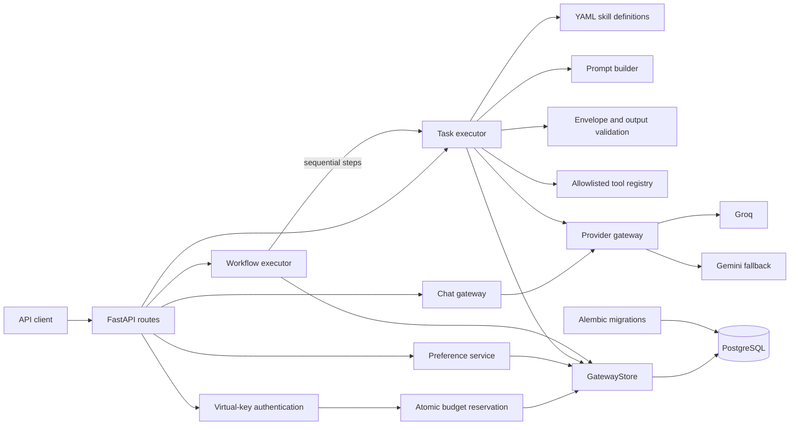
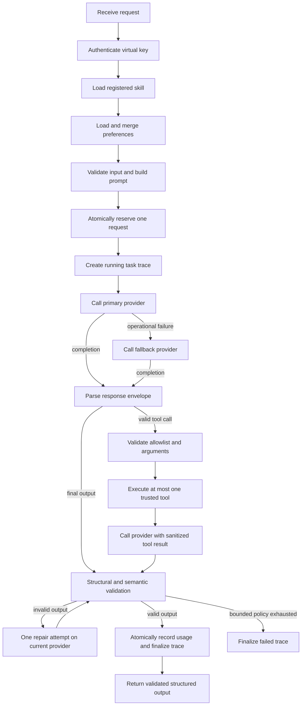
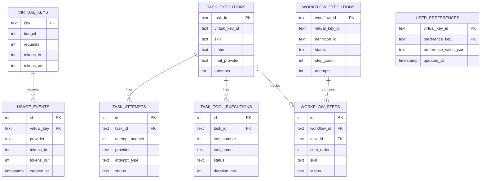

# Orchestrix

## Overview

Orchestrix is an AI execution platform for deterministic workflows, structured output validation, provider abstraction, bounded tool execution, authenticated usage controls, and persistent execution tracing.

It supports direct chat completions, schema-validated skills, and fixed sequential workflows while keeping provider credentials, fallback policy, accounting, and orchestration under application control.

### Live demo

- **API Base URL:** https://orchestrix-yc6s.onrender.com
- **Swagger UI:** https://orchestrix-yc6s.onrender.com/docs
- **Health Check:** https://orchestrix-yc6s.onrender.com/healthz

> The application is hosted on Render's free tier and may take around a minute to wake after inactivity.

## Architecture

The gateway layer owns HTTP contracts, authentication, budgets, provider clients, usage accounting, and persistence. `TaskExecutor` coordinates skills, prompts, validation, repair, fallback, and bounded tools. `WorkflowExecutor` runs trusted, predeclared task sequences without dynamic planning, branching, or recursion.



The implementation uses Python, FastAPI, Pydantic, HTTPX, PostgreSQL, SQLAlchemy, psycopg, Alembic, PyYAML, pytest, Docker, and Uvicorn. It does not depend on an agent framework.

## Key Capabilities

- Bearer authentication with predefined virtual API keys and request budgets
- Atomic PostgreSQL budget reservation under concurrent requests
- Groq as the primary provider with automatic Gemini fallback
- Gateway-owned provider selection; clients cannot choose the upstream model
- YAML-defined skills (`summarize`, `extract_action_items`)
- JSON-only model response protocol with Pydantic validation and bounded repair
- Typed, allowlisted tools with validated arguments and bounded execution
- Deterministic sequential workflow execution (`article_processing`)
- Persistent task, workflow, provider-attempt, tool, and usage records
- Virtual-key-scoped execution preferences
- Deterministic tests using fake providers and isolated PostgreSQL schemas
- Load tested with Locust against real LLM providers

## Request Lifecycle



Requests are authenticated and validated before one budget unit is reserved. Execution then follows bounded repair, fallback, and tool policies; provider attempts are traced, usage is aggregated, and only validated structured output is returned after atomic accounting and trace settlement.

## Workflow Overview

`article_processing` executes three fixed steps:

1. Summarize the source text.
2. Extract action items from the source and validated summary.
3. Generate a final summary with access to `text_statistics`.

Every step reuses the task execution pipeline, including validation, repair, fallback, tools, and tracing. Steps run sequentially, and a failed step prevents later steps from running.

## Database Schema



PostgreSQL stores virtual keys, usage, task and workflow traces, provider attempts, tool executions, and preferences. `GatewayStore` provides the SQLAlchemy persistence boundary; Alembic manages migrations, and application startup verifies the database, applies migrations, and idempotently seeds local-development keys. Sensitive prompts, raw provider responses, credentials, tool arguments, and tool results are not persisted.

## Authentication

Authenticated endpoints require:

```http
Authorization: Bearer <virtual-key>
```

| Seeded key | Request budget |
| --- | ---: |
| `vk_open` | 50 |
| `vk_tiny` | 2 |
| `vk_edge` | 1 |

Budgets count admitted requests, not tokens or currency.

## Provider Architecture

- Provider calls return a normalized `ProviderCompletion` containing content, token usage, and provider name.
- Groq is the primary provider; Gemini is the fallback.
- `GROQ_MODEL` and `GEMINI_MODEL` control upstream models; the client's `model` value is not forwarded.
- Invalid structured output receives at most one repair attempt on the same provider.
- Operational failures may trigger fallback, while configuration failures stop safely.
- Repair and fallback do not reserve additional request units.
- Provider calls are capped at four per task or workflow step.

## Concurrency Guarantees

Budget admission uses one conditional PostgreSQL update:

```sql
UPDATE virtual_keys
SET requests = requests + 1
WHERE key = :key AND requests < budget
RETURNING key;
```

PostgreSQL serializes conflicting updates to the same virtual-key row. Once the final unit is consumed, concurrent callers re-evaluate the budget condition and cannot overspend it.

- One admitted chat, task, or workflow consumes one request unit.
- Repair, fallback, tools, and workflow steps consume no additional request units.
- Usage from all reported provider completions is aggregated.
- Final usage and trace settlement are persisted atomically.

## Error Handling

Errors are mapped to stable HTTP responses without exposing provider bodies, prompts, credentials, database URLs, SQL, or stack traces.

| Status | Typical meaning |
| ---: | --- |
| `401` | Missing, malformed, or unknown virtual key |
| `404` | Unknown skill, workflow, task trace, workflow trace, or non-owned trace |
| `422` | Invalid request shape, task input, workflow input, or preference value |
| `429` | Virtual-key request budget exhausted |
| `500` | Provider configuration, local configuration, persistence, tracing, or accounting failure |
| `502` | Providers unavailable, invalid output after bounded repair, tool failure, or workflow-step failure |

Trace lookup returns `404` for both unknown and non-owned IDs to avoid disclosing ownership.

## API Endpoints

FastAPI exposes:

- Swagger UI: `/docs`
- OpenAPI specification: `/openapi.json`

| Method | Path | Authentication | Purpose |
| --- | --- | --- | --- |
| `POST` | `/v1/chat/completions` | Bearer virtual key | Direct provider-backed chat completion |
| `POST` | `/v1/tasks/execute` | Bearer virtual key | Execute a registered skill and return validated output |
| `GET` | `/v1/tasks/{task_id}` | Bearer virtual key | Retrieve an owned task trace and ordered attempt history |
| `POST` | `/v1/workflows/execute` | Bearer virtual key | Execute a registered fixed workflow |
| `GET` | `/v1/workflows/{workflow_id}` | Bearer virtual key | Retrieve an owned workflow trace and step history |
| `GET` | `/v1/preferences` | Bearer virtual key | Retrieve reusable preferences |
| `PUT` | `/v1/preferences` | Bearer virtual key | Atomically upsert supplied preferences |
| `DELETE` | `/v1/preferences/{preference_key}` | Bearer virtual key | Idempotently delete one preference |
| `GET` | `/usage?key={virtual-key}` | Query parameter | Return request, token, budget, spend, and remaining totals |
| `GET` | `/healthz` | None | Process health check |

## API Examples

Detailed request and response examples are available in `docs/API_EXAMPLES.md`.


## Performance Benchmark

### Baseline Benchmark (Real LLM Providers)

- Tool: Locust
- Duration: 29 seconds
- Successful task executions: 6
- Request failures: 0%
- Average task latency: 1.92 seconds
- P95 latency: 2.9 seconds
- P99 latency: 2.9 seconds

This benchmark measures successful end-to-end task execution through real LLM providers, including authentication, validation, provider execution, tracing, persistence, and usage accounting.

Under sustained concurrent load, upstream provider failures were surfaced as `502 all providers unavailable` without hanging or crashing. These responses reflect upstream availability, not gateway throughput.

## Design Decisions

- **Explicit orchestration:** Typed Python control flow keeps repair, fallback, tool limits, and workflow order auditable without an agent framework.
- **Trusted definitions:** Skills, workflows, and tools are application-owned; runtime input and model output cross explicit validation boundaries.
- **Distinct failure policies:** Repair corrects invalid output, retry repeats a technical operation, and fallback switches providers.
- **Bounded tools:** Only validated, allowlisted, registry-owned callables can execute.
- **Privacy-conscious traces:** Execution history stores operational metadata without sensitive prompts, raw responses, tool arguments, or tool results.

## Local Development

### Prerequisites

- Python 3.12+
- Docker Desktop or PostgreSQL 17
- Groq and Gemini credentials for real provider calls

### Setup

```powershell
py -m venv .venv
.\.venv\Scripts\Activate.ps1
py -m pip install -r requirements.txt
Copy-Item .env.example .env
docker compose up -d postgres
py -m alembic upgrade head
py -m uvicorn app.main:app --reload
```

### Environment variables

Required:

- `DATABASE_URL`
- `GROQ_API_KEY`
- `GEMINI_API_KEY`

Optional:

- `GROQ_MODEL`
- `GEMINI_MODEL`
- `PROVIDER_TIMEOUT_SECONDS`

Additional variables are documented in [.env.example](.env.example).

### Tests

```powershell
py -m pytest -q
```

Tests use fake providers and isolated PostgreSQL schemas to ensure deterministic execution.

## Docker Setup

```powershell
docker compose up --build
docker compose ps
docker compose logs -f gateway
docker compose down
```

The gateway runs on `localhost:8000` and PostgreSQL on `localhost:5432`; PostgreSQL data persists in the `postgres-data` volume.

## Current Limitations

- Authentication uses predefined virtual keys; issuance, rotation, revocation, expiry, scopes, and JWT authentication are not implemented.
- Workflow execution is synchronous and does not use a durable background queue.
- Provider support is limited to Groq and Gemini.
- Observability is lightweight and does not include distributed tracing or Prometheus/OpenTelemetry metrics.

## Future Improvements

- Add asynchronous execution using a durable job queue.
- Support horizontal scaling and distributed deployments.
- Add provider integrations and model-routing strategies.
- Integrate OpenTelemetry, Prometheus, and Grafana.

## License

This project is licensed under the MIT License. See [LICENSE](LICENSE) for details.
